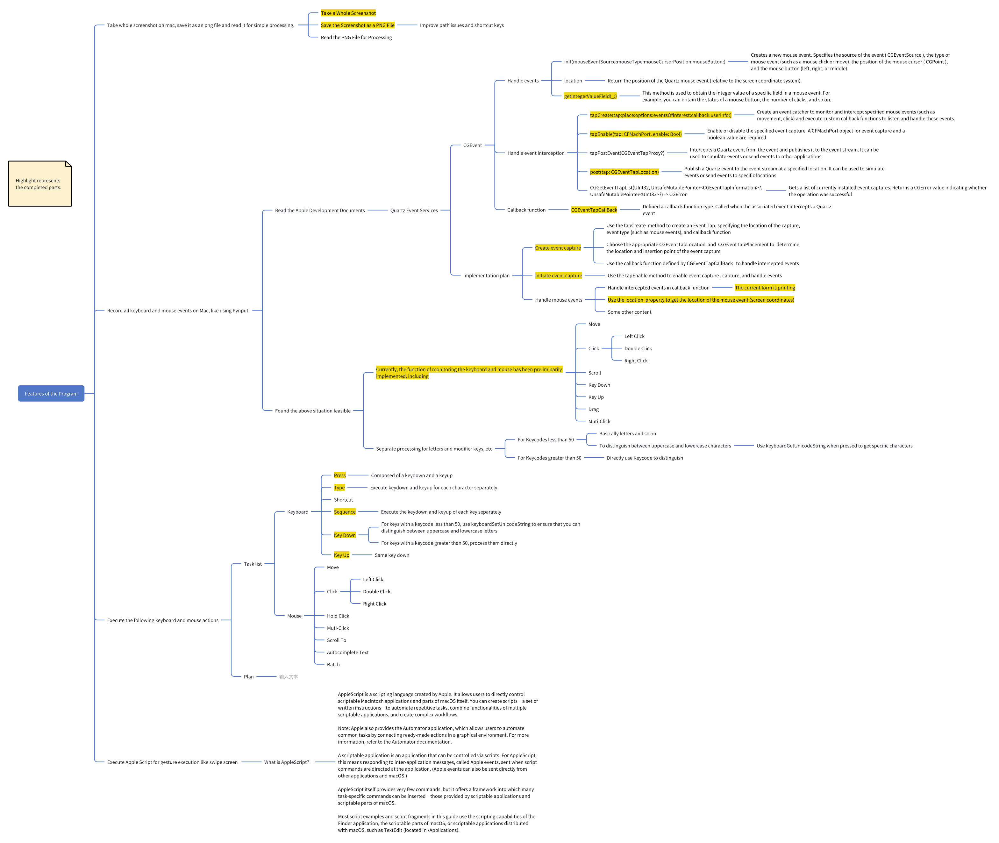
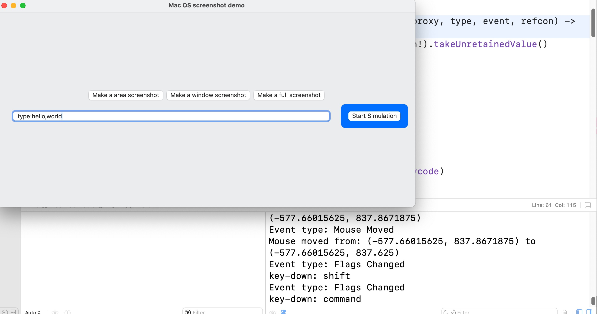

This is a developing project.

20240807 1907 PT 


Let me try to implement the frontend code based on Xianze's project to use just one button to trigger it. 
Let me look through the scripts in Swift first. 

Let GPT4 implement these functions defined in these python script. 
https://github.com/chenyiyun573/YuantsyDesktopAgentFrontendDemo/blob/main/main.py
https://github.com/chenyiyun573/YuantsyDesktopAgentFrontendDemo/blob/main/executor.py
Modify the simulator button handling here to trigger the frontend code. 
https://github.com/Xianze0112/MacOS-Frontend-Exploring/blob/main/Mac%20OS%20screenshot%20demo/Simulator.swift

I added 3 files to it:
```
Executor.swift
Simulator.swift
Networking.swift
```

Build Successfully, but the following errors reported in terminal of Xcode:
```
networkd_settings_read_from_file Sandbox is preventing this process from reading networkd settings file at "/Library/Preferences/com.apple.networkd.plist", please add an exception.
networkd_settings_read_from_file Sandbox is preventing this process from reading networkd settings file at "/Library/Preferences/com.apple.networkd.plist", please add an exception.
Cannot start load of Task <C90035F4-F3D5-4F68-8C59-4D797129C8BB>.<1> since it does not conform to ATS policy
Task <C90035F4-F3D5-4F68-8C59-4D797129C8BB>.<1> finished with error [-1022] Error Domain=NSURLErrorDomain Code=-1022 "The resource could not be loaded because the App Transport Security policy requires the use of a secure connection." UserInfo={NSLocalizedDescription=The resource could not be loaded because the App Transport Security policy requires the use of a secure connection., NSErrorFailingURLStringKey=http://agent2.yuantsy.com:8000/sessions/, NSErrorFailingURLKey=http://agent2.yuantsy.com:8000/sessions/, _NSURLErrorRelatedURLSessionTaskErrorKey=(
    "LocalDataTask <C90035F4-F3D5-4F68-8C59-4D797129C8BB>.<1>"
), _NSURLErrorFailingURLSessionTaskErrorKey=LocalDataTask <C90035F4-F3D5-4F68-8C59-4D797129C8BB>.<1>, NSUnderlyingError=0x600003aa56e0 {Error Domain=kCFErrorDomainCFNetwork Code=-1022 "(null)"}}
Network error or data corrupted
BOOL _NSPersistentUIDeleteItemAtFileURL(NSURL *const __strong) Failed to stat item: file:///Users/chenyiyun/Library/Containers/com.example.Mac-OS-screenshot-demo/Data/Library/Saved%20Application%20State/com.example.Mac-OS-screenshot-demo.savedState/restorecount.plist
```

Answers from GPT4:
```
It looks like you're encountering several macOS development-related issues, particularly involving App Transport Security (ATS) and sandboxing. Let's address these step by step:

### 1. Sandbox Issue
The error message about the sandbox preventing access to network settings (`com.apple.networkd.plist`) suggests that your application is trying to access system-level files or settings which are restricted by the macOS sandbox environment. 

#### Solution:
- **Modify Entitlements**: If your app genuinely needs to access such files, you might need to modify its sandbox entitlements. This is often restricted and typically not allowed for App Store applications. If your app is for personal use or internal distribution, you could adjust the entitlements in your `.entitlements` file to allow more privileges.
- **Review Necessity**: Consider if your application really needs to access these files, as this could pose security risks and complicate App Store submission.

### 2. App Transport Security (ATS) Error
The ATS error is because your application is trying to access resources over an insecure connection (`http://` instead of `https://`). ATS is a security feature in iOS and macOS that forces applications to use HTTPS for network connections unless exceptions are specified.

#### Solution:
- **Use HTTPS**: The best and recommended approach is to modify your server to support HTTPS. This ensures that the data transmitted between your app and the server is encrypted and secure.
- **ATS Exception**: If you cannot switch to HTTPS immediately, you can configure exceptions in your app’s `Info.plist` file to allow insecure connections temporarily. Here's how you can add an exception for your specific URL:

    ```xml
    <key>NSAppTransportSecurity</key>
    <dict>
        <key>NSAllowsArbitraryLoads</key>
        <false/>
        <key>NSExceptionDomains</key>
        <dict>
            <key>yuantsy.com</key>
            <dict>
                <key>NSIncludesSubdomains</key>
                <true/>
                <key>NSTemporaryExceptionAllowsInsecureHTTPLoads</key>
                <true/>
                <key>NSTemporaryExceptionMinimumTLSVersion</key>
                <string>TLSv1.1</string>
            </dict>
        </dict>
    </dict>
    ```

### 3. File System Access Issue
The failure to access specific files in your app container (`restorecount.plist`) could be due to various reasons, such as incorrect file paths, issues with permissions, or the file not existing.

#### Solution:
- **Check File Existence and Path**: Ensure the file exists at the specified path and that your app has the correct permissions to access it.
- **Review File Operations**: If your application is trying to delete or modify the file, make sure these operations are handled correctly, checking for errors and ensuring the file isn't locked or in use.

### General Advice:
- **Logging and Error Handling**: Improve logging and error handling to provide more context about failures, which can help diagnose issues more effectively.
- **Testing on Different Environments**: Test your application in various environments and configurations to catch such issues early in the development process.

By addressing these issues, you should be able to resolve the errors and ensure your application behaves as expected under the security and operational constraints of macOS.
```


#### Table of Contents

1. Introduction
2. Requirements
3. Usage
4. Code Structure

------

#### Introduction

The **Mac OS Screenshot Demo App** is a Swift-based application designed to demonstrate the functionality of capturing screenshots and handling mouse and keyboard events on Mac OS. Currently, the functions of monitoring keyboard and mouse, saving screenshots, and simulating keyboard input have been implemented (for details, see Feishu Xianze's worklog to try MacOS Demo).

------

#### Features

- Capture screenshots of the screen.

- Handle mouse and keyboard events.

- Provide a simple user interface for interacting with the screenshot and event-handling features.

  

------

#### Requirements

- macOS 10.15 or later
- Xcode 12.0 or later
- Swift 5.3 or later

------

#### Usage

1. **Launching the App:**

   - Open the app on your Mac.
   - Grant necessary permissions for screen recording and accessibility in System Preferences.

2. **Capturing Screenshots:**

   - Click the "Capture Screenshot" button to capture the current screen.

3. **Handling Mouse and Keyboard Events:**

   - The app will display the mouse and keyboard events in real-time.
   - If you want to simulate the keyboard, enter commands in the input box to simulate，the specific commands are in the Feishu document.

   

------

#### Code Structure

1. **Simulator.swift:**
   - Handles the simulation functionalities for the application.
2. **screencaptureViewModel.swift:**
   - Contains the view model for the screen capture feature.
3. **Mouse_and_KeyBoard.swift:**
   - Defined an EventMasks struct to manage various macOS keyboard and mouse event masks and provide mappings between key codes and characters.
4. **Mac_OS_screenshot_demoApp.swift:**
   - The main application file that sets up the environment and launches the app.
5. **EventTapManager.swift:**
   - Handles the event tapping mechanism to capture and process mouse and keyboard events.
6. **ContentView.swift:**
   - Defines the user interface and user interactions for the application.

